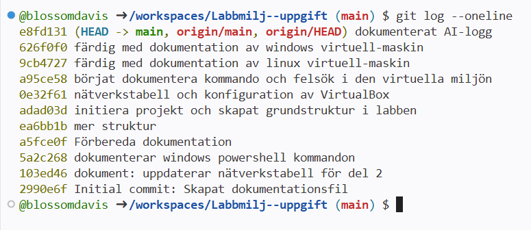

# Labbdokumentation
*Syftet med uppgiften är att visa mina praktiska färdigheter i att sätta upp och
dokumentera en virtuell labbmiljö, navigera och felsöka via kommandoraden i Linux och
Windows, spåra mitt arbete med Git samt reflektera kritiskt kring min AI-användning.* 

**Kurs:** *Introduktion till yrkesrollen och grunderna i IT-infrastruktur (MYH 2025/4008)*

**Av:** *Blossom Davis* | **Datum:** *2026-10-02*

## Nätverkstabell
*Labbmiljön sattes upp i VirtuaBox och består av en Linus-maskin (Ubuntu) och en Windows-maskin (Windows 11). För att maskinerna ska kunna kommunicera direkt med varandra gav jag de ett internt nätverk, detta för att det är ett isolerat nätverk utan internet så att labbtrafiken inte störs av min/värd datorn.*

*Båda maskiner har manuellt konfigurerats med ip-adresser inom samma nätverk med nätmasken /24. när miljön är isolerad som denna behövs det därför ingen anslutning mot externa nätverk och därför finns det ingen Standard Gateway.*

| Hostname        | Operativsystem  | IP-adress | Subnätmask | Standard Gateway |
|-----------------|-----------------|-----------|------------|-------------------|
| Blossom | Windows 11 | 192.168.1.51 | 255.255.255.0 | Saknas (internt nätverk) ||-----------------|-----------------|-----------|------------|-------------------|
| blossom | Ubuntu | 192.168.1.50 | 255.255.255.0 | Saknas (internt nätverk) |

## Arbete med kommando och felsökning 
### Linux (Ubuntu)

- Skapa mappen och filen
> sudo mkdir -p /var/systementor/konsultdata\
> sudo touch /var/systementor/konsultdata/anteckningar.txt

*Sudo körs för att ge administratörsrättigheter.\
Flaggan -p skapar mappar som inte finns, utan att ge ett felmeddelande.*

- Skapa användargrupp 
> sudo groupadd konsulter

- Tilldela mappen och filen till gruppen (konsulter) och ställ in behörigheter
> sudo chown -R :konsulter /var/systementor/konsultdata

> chmod 750 konsultdata\
> chmod 640 anteckningar.txt

*Flaggan -R gör så att ändringen gäller både mappen och dess underfiler.*

- Inspektera behörigheter
> ls -la

- Verifiera nätverksanslutningen 
> ip addr show

### Windows (PowerShell)

- Skapa mappen 
> New-Item -Path "C:\Systementor\KonsultData" -ItemType Directory -Force

- Inspektera och dokumentera behörighetsstrukturen
> Get-Acl -Path "C:\Systementor\KonsultData" | Format-List

- Verifiera nätverksanslutning och inspektera nätverksinställningar
> ping 192.168.1.50

*192.168.1.50 = nätverksadressen till Linux-maskinen.*

> ipconfig /all

## Git & Versionshantering 
https://github.com/blossomdavis/Labbmilj--uppgift

> git log --oneline 

## AI-logg & Utvärdering 
*Prompt, AI-utdata och min kritiska granskning.* 

#### Min AI-prompt:
> Förklara i detalj vad som menas med funktionen "behörighet" inom it-infrastruktur.\
Ge mig ett antal exempel för att förstå det ur ett praktiskt perspektiv, och en lista med för- och nackdelar.

#### AI-svaret:

> Inom IT-infrastruktur syftar behörighet (eller auktorisering, engelska: authorization) på den rättighet eller tillåtelse en användare, process eller enhet har att komma åt, ändra eller utföra åtgärder på en specifik resurs. Medan autentisering svarar på frågan "Vem är du?" (t.ex. genom inloggning med lösenord eller BankID), svarar behörighet på frågan "Vad får du göra?".
> 
> **Praktiska exempel**\
> Behörigheter styrs oftast genom regelsystem som definierar vem som får göra vad på olika nivåer i IT-infrastrukturen: 
> 
> Fil- och mappsäkerhet (NTFS/Linux-rättigheter): En ekonomiavdelning har behörighet att läsa och skriva i mappen för årsredovisningar, medan övriga anställda varken kan öppna eller se filerna.  
> 
> Databasåtkomst (RBAC - Rollbaserad behörighetsstyrning): En kundtjänstmedarbetare har behörighet att se en kunds adress, men saknar behörighet att ändra kundens kreditgräns eller radera kunden ur databasen. 
>  
> Nätverksinfrastruktur (Brandväggar och VLAN): En konsult som ansluter till gäst-Wi-Fi har behörighet att nå internet, men saknar behörighet att kommunicera med företagets interna servrar. 
> 
> Molntjänster (IAM - Identity & Access Management): En systemadministratör har behörighet att skapa nya virtuella maskiner i AWS/Azure, medan en utvecklare endast får starta och stoppa befintliga testmaskiner. 
> 
>
> ### För- och nackdelar med behörighetsstyrning
  > 
  > **Fördelar**
  > 
  > Ökad datasäkerhet: Förhindrar obehöriga från att komma åt känslig information eller affärskritiska system. 
  > 
  >Minskad skaderadie (Principle of Least Privilege): Om ett konto blir hackat eller drabbas av skadlig kod begränsas skadan till vad kontot har behörighet till. 
  > 
  > Spårbarhet och regelefterlevnad: Gör det enkelt att uppfylla lagkrav (t.ex. GDPR) och spåra vem som gjort ändringar i systemen. 
  > 
  > **Nackdelar:** 
  Administrativ komplexitet: Att konfigurera och underhålla rätt behörighetsnivåer för hundratals användare kräver tid och resurser. 
  > 
  > Minskad användarflexibilitet: För stränga behörigheter kan skapa flaskhalsar och hindra medarbetare från att utföra sitt dagliga arbete effektivt. 
  > 
  > Risk för "Privilege Creep": Användare samlar ofta på sig nya behörigheter över tid när de byter roller, vilket skapar dolda säkerhetsrisker om det inte rensas regelbundet.

##

### Kritisk utvärdering
Jag anser att koden/förklaringen var korrekt. AI:n ger ett naturligt, konkret och nyanserat exempel som förklaras på ett bra sätt. Jag ser inga tydliga tecken på varken hallucinationer eller föråldrad kod. 

För att säkerställa att svaret inte var värderande bad jag den att rada upp för- nackdelar för att visa en ännu mer nyanserad bild av ämnet. Sedan sökte jag även på andra oberoende källor för att bekräfta faktan. 

Dock nämner inte AI:n konkreta kommando-exempel som chmod eller liknande, men det var inte heller tydligt efterfrågat i prompten. 
