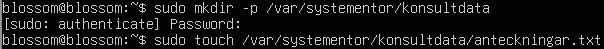
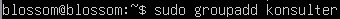
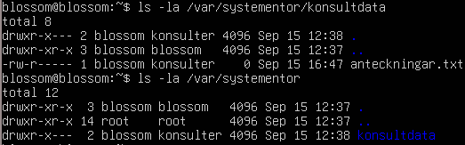
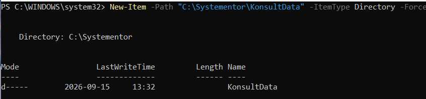
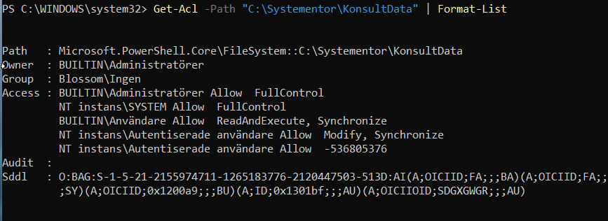

# Labbdokumentation
*Syftet med uppgiften är att visa mina praktiska färdigheter i att sätta upp och
dokumentera en virtuell labbmiljö, navigera och felsöka via kommandoraden i Linux och
Windows, spåra mitt arbete med Git samt reflektera kritiskt kring min AI-användning.* 

**Kurs:** *Introduktion till yrkesrollen och grunderna i IT-infrastruktur (MYH 2025/4008)*

**Av:** *Blossom Davis* | **Datum:** *2026-10-02*

## Nätverkstabell
*Labbmiljön sattes upp i VirtuaBox och består av en Linus-maskin (Ubuntu) och en Windows-maskin (Windows 11). För att maskinerna ska kunna kommunicera direkt med varandra gav jag de ett internt nätverk, detta för att det är ett isolerat nätverk utan internet så att labbtrafiken inte störs av min/värd datorn.*

*Båda maskiner har manuellt konfigurerats med ip-adresser inom samma nätverk med nätmasken /24. när miljön är isolerad som denna behövs det därför ingen anslutning mot externa nätverk och därför finns det ingen Standard Gateway.*

| Hostname        | Operativsystem  | IP-adress | Subnätmask | Standard Gateway |
|-----------------|-----------------|-----------|------------|-------------------|
| Blossom | Windows 11 | 192.168.1.51 | 255.255.255.0 | Saknas (internt nätverk) ||-----------------|-----------------|-----------|------------|-------------------|
| blossom | Ubuntu | 192.168.1.50 | 255.255.255.0 | Saknas (internt nätverk) |

## Arbete med kommando och felsökning 
*Syftet.*
### Linux (Ubuntu)

- Skapa mappen och filen
> sudo mkdir -p /var/systementor/konsultdata\
> sudo touch /var/systementor/konsultdata/anteckningar.txt

*Sudo körs för att ge administratörsrättigheter.\
Flaggan -p skapar mappar som inte finns, utan att ge ett felmeddelande.*

- Skapa användargrupp 
> sudo groupadd konsulter

- Tilldela mappen och filen till gruppen (konsulter) och ställ in behörigheter
> sudo chown -R :konsulter /var/systementor/konsultdata

> chmod 750 konsultdata\
> chmod 640 anteckningar.txt

*Flaggan -R gör så att ändringen gäller både mappen och dess underfiler.*

- Inspektera behörigheter
> ls -la

- Verifiera nätverksanslutningen 
> ip addr show

![ip-adress][def]

### Windows (PowerShell)

- Skapa mappen 
> New-Item -Path "C:\Systementor\KonsultData" -ItemType Directory -Force

- Inspektera och dokumentera behörighetsstrukturen
> Get-Acl -Path "C:\Systementor\KonsultData" | Format-List

- Verifiera nätverksanslutning och inspektera nätverksinställningar
> ping 192.168.1.50

*192.168.1.50 = nätverksadressen till Linux-maskinen.*

> ipconfig /all

## Git & Versionshantering 
*Länka till mitt Git-repository samt skärmdump på min git log --oneline som visar din ändringshistorik.*
> URL + git log --oneline

## AI-logg & Reflektion 
*Prompt, AI-utdata och din kritiska granskning.* 
> citat?

